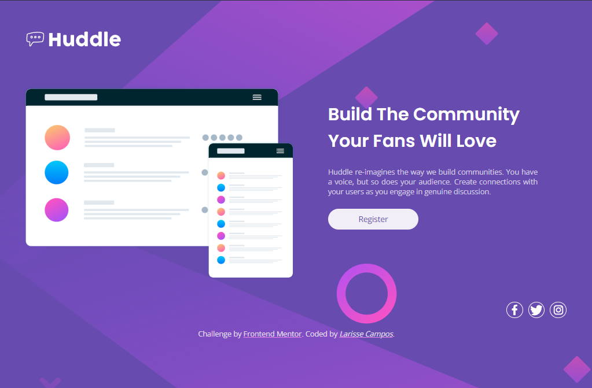

# Frontend Mentor - Huddle landing page with single introductory section solution

Esta é uma solução ao projeto: [Huddle landing page with single introductory section challenge on Frontend Mentor](https://www.frontendmentor.io/challenges/huddle-landing-page-with-a-single-introductory-section-B_2Wvxgi0).  

## Menu de conteúdos 

- [Overview](#overview)
  - [O desafio](#the-challenge)
  - [Screenshot](#screenshot)
  - [Links](#links)
- [Meu processo](#my-process)
  - [Tecnologias](#built-with)
  - [Desenvolvimento contínuo](#continued-development)
  - [Recursos](#useful-resources)
- [Autor](#author)

## Overview

### O desafio
Os usuários devem ser capazes de:

- Visualize o layout ideal para a página, dependendo do tamanho da tela do dispositivo
- Veja os estados de hover para todos os elementos interativos na página

### Screenshot

### Links

- Solution URL: [Add solution URL here](https://your-solution-url.com)
- Live Site URL: [Add live site URL here](https://your-live-site-url.com)

## Meu processo

### Tecnologias

- Semantic HTML5 markup
- CSS custom properties
- Flexbox
- Responsivo

### Desenvolvimento contínuo

Melhorar o responsivo do projeto e fluidez das transições. Posteriormente gostaria de implementar mais interações para o usuário.

### Recursos

- [CSS_Scan](https://getcssscan.com/css-box-shadow-examples) - Utilizei este site para o box-shadow do botão "registre-se".

## Author

- Frontend Mentor - [@LarisseCampos](https://www.frontendmentor.io/profile/LarisseCampos)
- Linkedin - [@LarisseCampos](https://www.linkedin.com/in/larisse-campos/)
