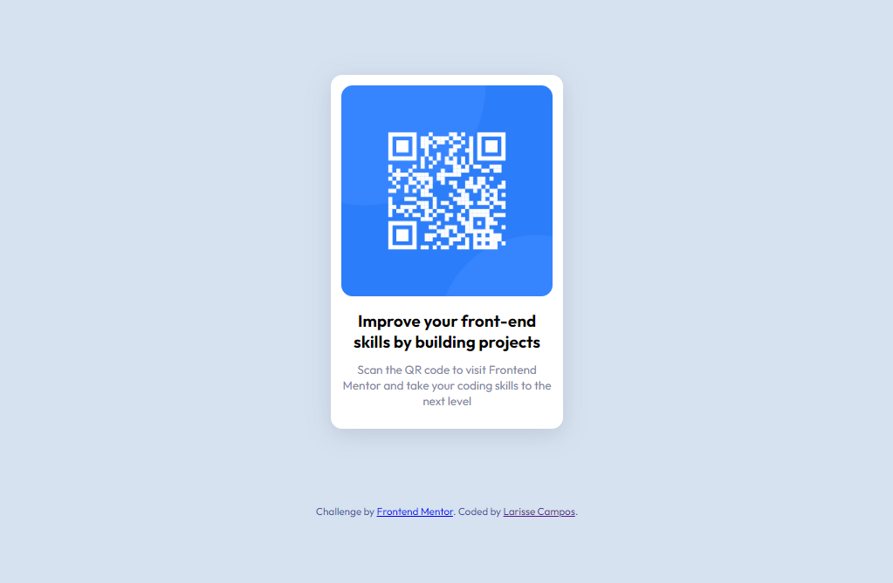

# Frontend Mentor - QR code component solution

Esta é a minha solução para o desafio [QR code component challenge on Frontend Mentor](https://www.frontendmentor.io/challenges/qr-code-component-iux_sIO_H). Proposto pela plataforma Frontend Mentor.  

## O desafio

Seu desafio é construir este componente de código QR e fazê-lo parecer o mais próximo possível do design.

Você pode usar qualquer ferramenta que desejar para ajudá-lo a completar o desafio. Então, se você tem algo que gostaria de praticar, sinta-se à vontade para tentar.

## Tabela de conteudos

- [Overview](#overview)
  - [Screenshot](#screenshot)
  - [Links](#links)
- [Meu processo](#meu-processo)
  - [O que eu aprendi]
- [Autor](#autor)

## Overview

### Screenshot

### Links

- Meu projeto completo: [Qr-code-component](https://qr-code-component-complete.vercel.app/)

## Meu processo

- HTML5
- CSS3
- Flexbox
- Responsivo 

### O que eu aprendi

- Com este projeto fui capaz de colocar em prática os conceitos básicos tanto de HTML5 quanto CSS3;
- Utilização das tags semânticas do HTML5;
- E desenvolvimento do responsivo da página;

## Autor

- Frontend Mentor - [@LarisseCampos](https://www.frontendmentor.io/profile/LarisseCampos)
- Linkedin - [@LarisseCampos](https://www.linkedin.com/in/larisse-campos/)

