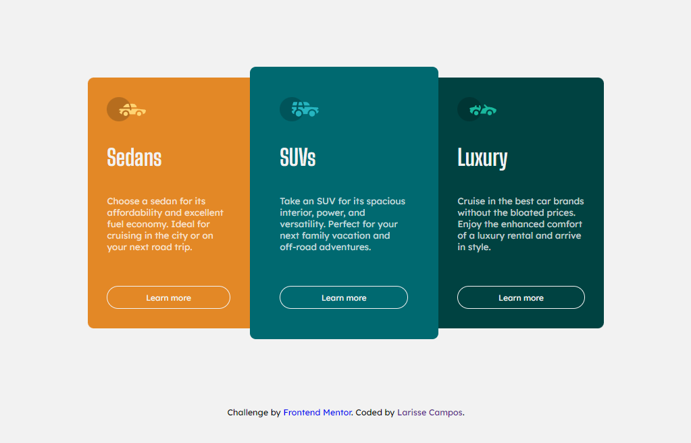

# Frontend Mentor - 3-column preview card component solution

Esta é a minha solução para o desafio [3-column preview card component challenge on Frontend Mentor](https://www.frontendmentor.io/challenges/3column-preview-card-component-pH92eAR2-). 

## Overview

### The challenge

Os usuários devem ser capazes de:

- Ver o layout ideal dependendo do tamanho da tela do dispositivo
- Ver os estados de foco para elementos interativos

### Screenshot

### Links

- Solution URL: [https://column-card-component-frontendmentor.vercel.app/](https://column-card-component-frontendmentor.vercel.app/)

## My process

### Built with

- HTML5  
- CSS 
- Flexbox
- CSS Grid
- Responsivo

### O que eu aprendi

Com este projeto fui capaz de adquirir conhecimento em flexbox, grid, responsividade e semântica em HTML5. 

### Desenvolvimento contínuo

Melhorar o responsivo do projeto e fluidez das transições. Posteriormente gostaria de implementar mais interações para o usuário.

## Autor

- Frontend Mentor - [@LarisseCampos](https://www.frontendmentor.io/profile/LarisseCampos)
- Linkedin - [@LarisseCampos](https://www.linkedin.com/in/larisse-campos/)

